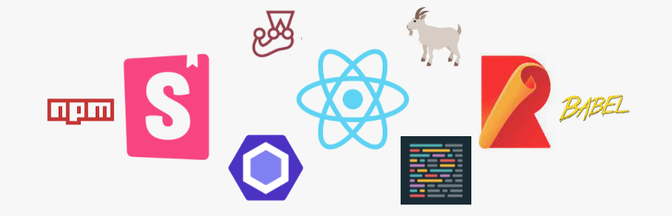

# nag-rlib  [Nag React Library]

 

[](https://www.npmjs.com/package/nag-rlib) [](https://standardjs.com)

nag-rlib is an component library which is a collection of logically group components so that one can explore, select components and helps in maintaining consistent design across projects. nag-rlib built usng following components.

1. create-react-library
2. Storybook
3. react-testing-library

## Install

```bash
npm install --save nag-rlib
```

## Usage

```jsx
import React, { Component } from 'react'

import MyComponent from 'nag-rlib'
import 'nag-rlib/dist/index.css'

class Example extends Component {
  render() {
    return <MyComponent />
  }
}
```

## Documentation

1. [Building A `Component Library` With React](./docs/Steps-To-Create-Library.md)

2. [Adding Storybook](./docs/Storybook.md)

3. [References](./docs/References.md)

4. [Coding Standards](./docs/Coding-Standards.md)

## License

NAG VBT © [nagvbt](https://github.com/nagvbt)
