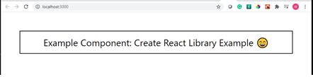
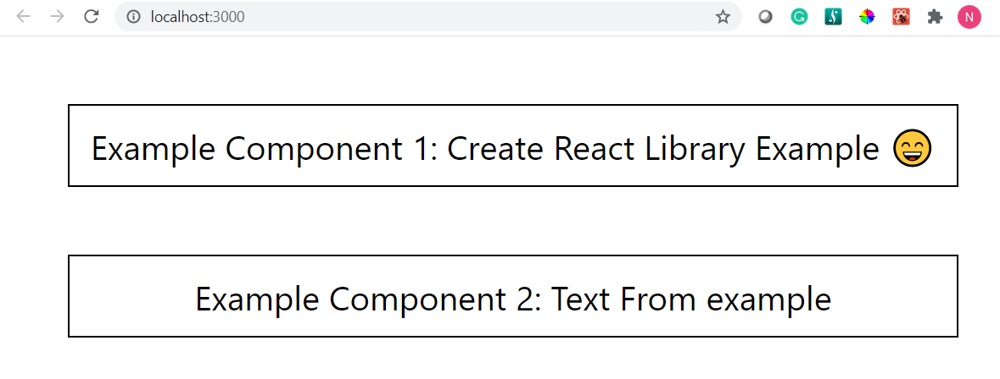

# Building A Component Library With React

- [1. Summary](#1-summary)
- [2. How to Create a React Library](#2-how-to-create-a-react-library)
- [3. Build and Launch the example site](#3-build-and-launch-the-example-site)
- [4. Create Github Repo and push the code](#4-create-github-repo-and-push-the-code)
- [5. Upgrade Packages](#5-upgrade-packages)
- [6. Export Multiple Components](#6-export-multiple-components)
- [7. Install Storybook](#7-install-storybook)
- [8. Unit Testing and Code Coverage](#8-unit-testing-and-code-coverage)

<small><i><a href='http://ecotrust-canada.github.io/markdown-toc/'>Table of contents generated with markdown-toc</a></i></small>

## 1. Summary

A component library is a collection of logically group components so that one can explore, select components and helps in maintaining consistent design across projects. nag-rlib built usng following components.

1. create-react-library
2. Storybook
3. react-testing-library

## 2. How to Create a React Library

You can create a React Library using the create-react-library (https://github.com/transitive-bullshit/create-react-library) CLI which uses Rollup.js and create-react-app.

[Rollup.js](https://rollupjs.org/guide/en/#overview) is a module bundler for JavaScript which compiles small pieces of code into something larger and more complex, such as a library.

**_Steps:_**

1.Install globally

This package requires node >= 10.

`npm install -g create-react-library`

2.Create Library

Fire up the command prompt and use the below commandcd

`npx create-react-library`

```js
Microsoft Windows [Version 10.0.19042.985]

(c) Microsoft Corporation. All rights reserved.

C:\Nag\myDrive\blog\React\NagLib>npx create-react-library
npx: installed 150 in 21.621s
? Package Name nag-rlib
? Package Description Nag React Library
? Author's GitHub Handle nagvbt
? GitHub Repo Path nagvbt/nag-rlib
? License NAG VBT
? Package Manager yarn
? Template default
```

## 3. Build and Launch the example site

To get started, in one tab, run:

`$ cd nag-rlib && yarn build`

And in another command window, run the create-react-app dev server:

`$ cd nag-rlib\example && yarn start`

  

## 4. Create Github Repo and push the code

Steps: Refer Code changes [here](https://github.com/nagvbt/nag-rlib/commit/03e8a144f5afa4edf43b8e47f3dd1facf8d63a6b)

a. Open command prompt and Fire up the command

`cd nag-rlib`

Use the below Git Commands to set the email and user name of the github

1.Update email and username using:

```js
	a.git config user.email "nagvbt@gmail.com"
	b.git config user.name "nagvbt"
```

2.Check if they are updated correctly:

```js
	a.git config user.email
	b.git config user.name
```

b. Create a new repository in Github with the same project name say nag-rlib

Create a new repository
…or push an existing repository from the command line

```js
git remote add origin https://github.com/nagvbt/nag-rlib.git
git branch -M main
git push -u origin main
```

## 5. Upgrade Packages

To upgrade the Packages to latest by using the command `yarn upgrade --latest`

Steps: Refer Code changes [here](https://github.com/nagvbt/nag-rlib/commit/0243b0a59267e9798502abf72705f6d1b02f7768)

## 6. Export Multiple Components

Steps: Refer Code changes [here](https://github.com/nagvbt/nag-rlib/commit/021a6cefe46e436333b0d7fdadb9b30573addf95)

1. Create Two components

   a. src\ExampleComponent1\ExampleComponent1.jsx

   ```jsx
   import React from 'react'
   import styles from '../../styles.module.css'

   function ExampleComponent1({ text }) {
     return <div className={styles.test}>Example Component 1: {text}</div>
   }

   export default ExampleComponent1
   ```

   b. src\ExampleComponent2\ExampleComponent2.jsx

   ```jsx
   import React from 'react'
   import styles from '../../styles.module.css'

   function ExampleComponent2({ text }) {
     return <div className={styles.test}>Example Component 2: {text}</div>
   }

   export default ExampleComponent2
   ```

2. Rename src\index.js to src\index.jsx

3. Change the extension of index.js to index.jsx in package.json

   ` "source": "src/index.jsx",`

4. Import the ExampleComponent1 and ExampleComponent2 in index.jsx and export them so that the example component can consume the two components

```jsx
import ExampleComponent1 from './components/ExampleComponent1/ExampleComponent1'
import ExampleComponent2 from './components/ExampleComponent2/ExampleComponent2'

export { ExampleComponent1, ExampleComponent2 }
```



## 7. Install Storybook

Storybook makes development faster and easier by isolating components with business logic. Install Storybook using below command.

`npx sb init`

**_Addons_**

Install Addons.

By Default you will get two Addons
a. Essential addons [Refer](https://storybook.js.org/docs/react/essentials/introduction)
b. addon-links

2. Add Aditional addons [Refer Code](https://github.com/nagvbt/nag-rlib/commit/076bb5062ef90720cf6741b2a257ad244865b883)

| S#  | Addon                                                                                | Command                                       | Description                                           |
| --- | ------------------------------------------------------------------------------------ | --------------------------------------------- | ----------------------------------------------------- |
| 1   | [a11y](https://github.com/storybookjs/storybook/tree/next/addons/a11y)               | yarn add @storybook/addon-a11y --dev          | Test components for user accessibility in Storybook   |
| 2   | [storysource](https://github.com/storybookjs/storybook/tree/next/addons/storysource) | yarn add @storybook/addon-storysource --dev   | View the code of your stories within the Storybook UI |
| 3   | [react-theming](https://github.com/react-theming/storybook-addon)                    | yarn add @react-theming/storybook-addon --dev | Allows to develop themed components in isolation.     |

## 8. Unit Testing and Code Coverage [Refer Code](https://github.com/nagvbt/nag-rlib/commit/5e2778980b9da0a02e43b5e3b69e753f4d35e238)

**a. Add React Testing Library** [Refer](https://github.com/testing-library/react-testing-library)

It is a very lightweight solution for testing React components. It provides light utility functions on top of react-dom and react-dom/test-utils, in a way that encourages better testing practices. To install react-testing-library use the below command.

`yarn add --dev @testing-library/react`

**b. Add DOM Testing Library** [Refer](https://github.com/testing-library/dom-testing-library#readme)

The DOM Testing Library is a very light-weight solution for testing DOM nodes. To install DOM Testing Library use the below command.

`yarn add --dev @testing-library/dom`

**c. Add Jest-Dom** [Refer](https://github.com/testing-library/jest-dom#readme)

The @testing-library/jest-dom library provides a set of custom jest matchers that you can use to extend jest. These will make your tests more declarative, clear to read and to maintain. To install Jest-Dom use the below command.

`yarn add --dev @testing-library/jest-dom`

**d. Add user-event** [Refer](https://github.com/testing-library/user-event)

user-event tries to simulate the real events that would happen in the browser as the user interacts with it. For example userEvent.click(checkbox) would change the state of the checkbox. To install user-event use the below command.

`yarn add --dev @testing-library/user-event`

**e. Add below code in package.json under scripts section to run the tests and generate the code coverage.**

`"test:dev": "react-scripts test --coverage --coverageDirectory='coverage' --env=jsdom --watchAll",`
